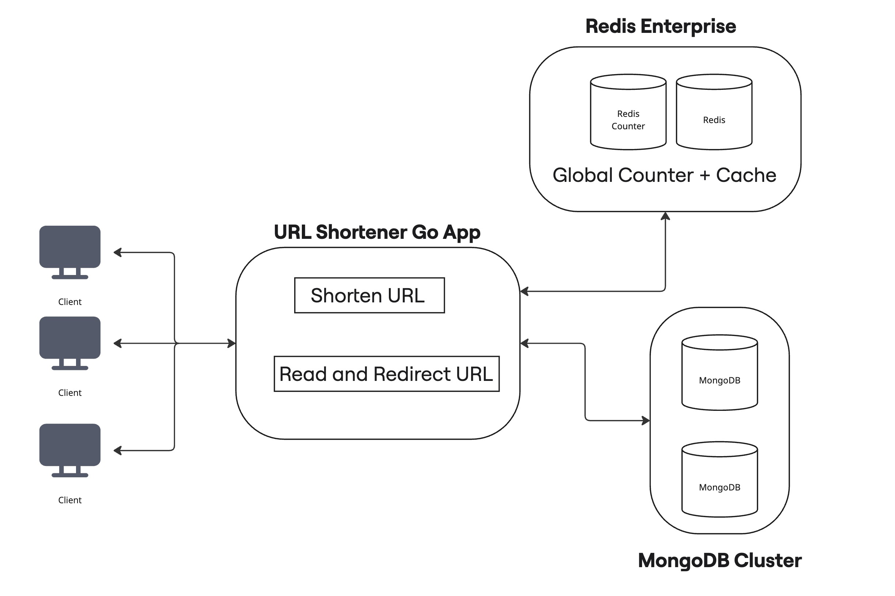
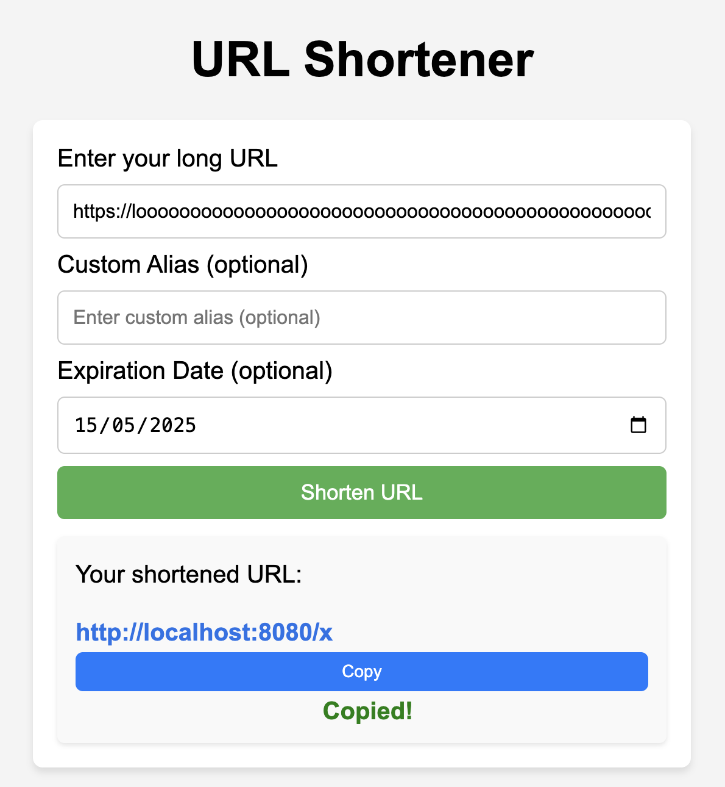

[](https://github.com/Jasoncheung94/url-shortener/actions/workflows/ci.yml)
[](https://github.com/Jasoncheung94/url-shortener/actions/workflows/release.yml)


# URL Shortener

URL Shortener is a Go-based application that allows users to shorten URLs and redirect by retrieving the original ones using short codes. Built as a learning and showcase project, it explores different practices in Go development, Dockerization, multi-database support, caching strategies, and architecture patterns.

This is a learning project and isn't meant for production use yet, but it demonstrates a backend built with real-world principles and tooling, making it easily adaptable for future development. It was created as a learning platform to explore and test various technologies and approaches step by step. While the project may not be complete, it effectively showcases different scenarios and database options, serving as a foundation for experimentation and learning.



This project uses a simple incrementing counter stored in Redis, combined with Base62 encoding, to generate short URLs.

Each time a new URL is shortened:

- A global counter is incremented.
- The integer is encoded in Base62 (digits + lowercase + uppercase letters).
- This produces a compact, human-readable short code starting from `1`.

## Feature Overview

| Core Functionality                                  | Developer Experience & Tooling                             |
| --------------------------------------------------- | ---------------------------------------------------------- |
| URL shortening, redirection, preview                | Dockerized local environment for easy setup                |
| PostgreSQL, MongoDB, in-memory support              | Modular, testable architecture with separation of concerns |
| Redis Enterprise for high availability              | Live reload with Air for rapid development                 |
| Redis counter management + persistence              | Makefile for automated build, test, run tasks              |
| Pluggable storage architecture (repository pattern) | Linter and static analysis (golangci-lint)                 |
| Rate limiting (multiple strategies supported)       | Mocks for unit testing (mockgen, gomock)                   |
| SQL migrations with golang-migrate                  | Integration tests with testcontainers                      |
| Health check & diagnostic routes (/health)          | Code coverage and HTML report                              |
| Graceful shutdown support                           | Swagger API documentation                                  |
| Logging & custom error handling                     | Docker GUI: Mongo Express, Redis Insight                   |
| URL shortening via Base62 + Counter                 | Auto Tagging/Release on push to main                       |
| Cache layer abstraction                             | CI/CD pipeline setup + Auto Tag and Release                |

## API Endpoints

| Method | Endpoint              | Description                        | Request Body / Notes                     | Response                          |
| ------ | --------------------- | ---------------------------------- | ---------------------------------------- | --------------------------------- |
| `GET`  | `/`                   | Home landing page with basic UI    | -                                        | HTML page                         |
| `GET`  | `/favicon.ico`        | Favicon asset                      | -                                        | `.ico` file                       |
| `GET`  | `/{shorturl}`         | Redirects to the original long URL | Path param: `shorturl`                   | `302 Found` redirect              |
| `GET`  | `/preview/{shorturl}` | Get original URL for a short code  | Path param: `shorturl`                   | JSON `{ "url": "..." }`           |
| `POST` | `/shorten`            | Create a new shortened URL         | JSON: `{ "url": "https://example.com" }` | JSON: `{ "shortCode": "abc123" }` |
| `GET`  | `/health`             | Health check endpoint              | -                                        | JSON: `{ "status": "OK" }`        |
| `GET`  | `/panic`              | Simulated panic (for testing )     | -                                        | Crashes intentionally             |
| `GET`  | `/swagger/`           | Swagger UI for API documentation   | Open in browser                          | Swagger HTML interface            |

## Getting Started + Running the Project

### Prerequisites

To run and develop this project locally, ensure you have the following installed:

🧰 Core Tools

- Go 1.23+: https://golang.org/dl/
- Docker + Compose Latest: https://docs.docker.com/get-docker/
- Make Any recent version: https://www.gnu.org/software/make/

⚙️ Additional Go Tools (used in make commands)

Run `make install-tools` to obtain required tools otherwise manually install:

- air Live reload: `go install github.com/air-verse/air@latest`
- golangci-lint Linting: `go install github.com/golangci/golangci-lint/cmd/golangci-lint@latest`
- swag Swagger docs generator: `go install github.com/swaggo/swag/cmd/swag@latest`
- migrate SQL migrations: `go install github.com/golang-migrate/migrate/v4/cmd/migrate@latest`

#### GUI/Links

| Description                                             | Links                  |
| ------------------------------------------------------- | ---------------------- |
| Mongo Express - Username: admin, password: pass         | http://localhost:8081/ |
| Redis Insight: Host = redis://default@redis-master:6379 | http://localhost:5540/ |
| URL Shortener:                                          | http://localhost:8080/ |

### Running the Project

To start development, use the provided make commands for convenience.

Start with Docker (backend and dependencies):
This will up the containers and run SQL migrations and run the Go app with live reload in the container.

```
make dev
```

or

Start with docker but run the Go app locally (with live reload via air):

```
make dev-local
```

**See [makefile](./Makefile) for full list**, Other commands include:

| Command                    | Description                                  |
| -------------------------- | -------------------------------------------- |
| `make test`                | Run tests with race flag                     |
| `make lint`                | Run golangci linter with config              |
| `make vet`                 | Vet your Go code for suspicious constructs   |
| `make swag`                | Generate swagger docs                        |
| `make generate`            | Generate all generated files eg Mocks        |
| `make coverage`            | Run coverage report - HTML report            |
| `make coverage-percentage` | Generate percentage of code covered by tests |

## Configuration

The configuration settings are defined in environment variables, and you can adjust them for your local or production environments. This is currently modified in the env vars of docker-compose otherwise it defaults to env vars in code.

## URL Model + DB Schema

```json
{
  "id": 123,
  "objectID": "681a04c49f9923e18b3898b9",
  "originalURL": "https://example.com/very/long/url",
  "shortURL": "https://sho.rt/abc123",
  "customURL": "mycustomalias",
  "expirationDate": "2025-05-11T23:59:59Z",
  "createdAt": "2025-05-10T14:30:00Z"
}
```

## Code Structure

The project is structured to promote clean separation of concerns, modularity, and ease of maintenance. Below are the key directories and their roles in the application.
The core layers—Handler, Service, Cache, and Repository are all encapsulated within the shortener folder, ensuring that the related code is grouped together for better organization and maintainability.

```
.
├── cmd
│   └── url-shortener
│       └── main.go                # Main application entry point
├── internal
│   ├── database
│   │   ├── database.go           # Common database functions
│   │   ├── mongo.go              # MongoDB connection and functions
│   │   ├── postgres.go           # PostgreSQL connection and functions
│   │   └── redis.go              # Redis connection and functions
|   |   ├── migrations            # SQL files and migrations
│   ├── errors
│   │   ├── errors_test.go        # Tests for error handling
│   │   └── errors.go             # Custom error types and handling
│   ├── logger
│   │   └── logger.go             # Logging setup and utilities
│   ├── middleware
│   │   ├── chain.go              # Middleware chain setup
│   │   ├── logger.go             # Logging middleware
│   │   ├── ratelimiter.go        # Rate limiting middleware
│   │   ├── recover.go            # Panic recovery middleware
│   ├── router
│   │   └── router.go             # Router setup and route definitions
│   ├── server
│   │   └── server.go             # HTTP server setup
│   ├── shortener
│   │   ├── handler.go            # URL shortener handler (HTTP handlers)
│   │   ├── model                 # URL model definitions and database schemas
│   │   ├── repository            # Repository layer for interacting with databases - split into database types.
│   │   ├── service.go            # URL shortening business logic
│   │   └── shorten.go            # Main URL shortening logic
```

## Testing

The project uses various testing strategies, including unit tests, integration tests. You can run tests using:

```
make test
```

This will run all the tests, including those with race detection enabled. In addition you can build a HTML report that shows code not covered by tests.

## Shortening the URL

This project uses a simple incrementing counter combined with Base62 encoding to generate short URLs. This approach was chosen for its simplicity, performance, and predictability. Each time a new URL is shortened, a global counter is incremented in Redis, and the resulting integer is encoded in Base62 (using digits, lowercase, and uppercase letters) to produce a compact, human-friendly short code. The short code starts from 1 maximizing the number of URL's we can use.

Why this approach? Efficiency: Using a counter ensures quick ID generation, and the Base62 encoding avoids collisions without needing additional storage or hashing.
Predictability: Since it's sequential, it's easy to reason about and scale.
Compactness: Base62 encoding creates shorter, more compact URLs than using plain numbers or UUIDs.

### Considerations:

Guessability: Because the IDs are sequential, someone could infer the number of URLs in the system or attempt to enumerate them. If this is a concern (e.g., for private or sensitive URLs), an alternative like a bijective function with a secret salt or other method (e.g., Squids) can be used to produce non-sequential, non-guessable identifiers.

Security: The current approach is not designed for security by obscurity. If unguessability is a requirement, consider using hashids, UUIDv7 with compression, or other cryptographic-safe approaches.

## Redis Availability

To ensure high availability of the counter, we can use Redis’s replication and persistence features. Redis Enterprise, for example, supports automatic failover and cross-region replication. For additional durability, the counter can be periodically persisted to a more durable backend (e.g., a SQL or NoSQL database). In this project, a simple Redis instance is used for local testing purposes. See Redis Enterprise for deploying live.

## UI

A simple UI design that takes in a long url, optional custom alias and expiration date.



## License

This project is licensed under the MIT License - see the [LICENSE](./LICENSE) file for details.
